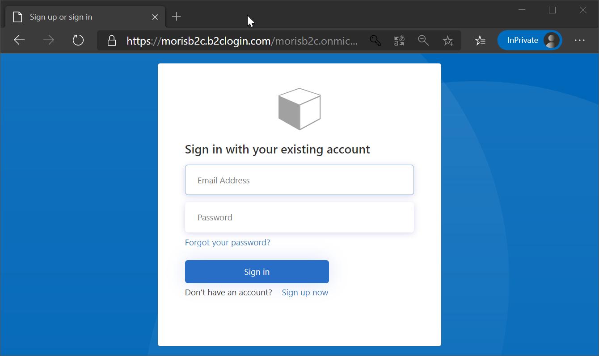

# Spring Boot with Azure AD / Azure AD B2C

## Introduction

Spring BootからAzure AD や Azure AD B2Cを利用した認証を実装するサンプルです。Spring Boot Security OAuth2 プロジェクトが deprecated になったので、新規ライブラリを利用します。

* [Spring Security OAuth](https://spring.io/projects/spring-security-oauth)
* [OAuth2 Boot](https://docs.spring.io/spring-security-oauth2-boot/docs/2.3.0.RELEASE/reference/html5/)
* https://docs.spring.io/spring-security-oauth2-boot/docs/2.3.0.RELEASE/reference/html5/

一部引用すると以下の通りです。

> The following projects are in maintenance mode:
> 
> - spring-security-oauth2
> - spring-security-oauth2-autoconfigure
> 
> You are, of course, welcome to use them, and we will help you out!
>
> However, before selecting spring-security-oauth2 and spring-security-oauth2-autoconfigure, you should check out Spring Security’s feature matrix to see if the new first-class support meets your needs.

# Prerequisite

## Azure AD
Azure ADへのアプリケーション登録と、AzureAD B2Cのテナントが必要です。Azure AD へのアプリケーション登録は、以下を参考にしてください。

[アプリを Azure AD に追加する方法と理由 - Microsoft identity platform | Microsoft Docs](https://docs.microsoft.com/ja-jp/azure/active-directory/develop/active-directory-how-applications-are-added)


登録すると以下の3つの情報が取得できます。

+ テナントID
+ クライアントID（アプリケーションID）
+ クライアントシークレット

## B2C

B2Cの詳しい説明は割愛しますが、テナントを作成、アプリケーションを登録、サインインのユーザーフローを作成しておきます。

1. [チュートリアル - Azure Active Directory B2C テナントを作成する | Microsoft Docs](https://docs.microsoft.com/ja-jp/azure/active-directory-b2c/tutorial-create-tenant)
2. [チュートリアル:アプリケーションを登録する - Azure AD B2C | Microsoft Docs](https://docs.microsoft.com/ja-jp/azure/active-directory-b2c/tutorial-register-applications?tabs=app-reg-ga)
3. [チュートリアル - ユーザー フローを作成する - Azure Active Directory B2C | Microsoft Docs](https://docs.microsoft.com/ja-jp/azure/active-directory-b2c/tutorial-create-user-flows)

上記の作業が終了すると、以下が取得できるはずです。

+ B2Cテナント名
+ クライアントID
+ クラアントシークレット
+ サインインフロー名

# Samples

## simple-web

Spring Boot フレームワークの機能のみを使って認証します。B2Cに限っては、Microsoftが提供するB2C starter があるのですが、それは次のサンプルで紹介します。

`application.sample.yaml` を `application.yaml`にコピーして以下の情報を設定します。

```json
spring:
  security:
    oauth2:
      client:
        registration:
        # Azure Active Directory
          azuread:
            client-id: <<aad client id>>
            client-secret : <<aad client secret>>
            client-name: Azure Active Directory
            scope: 
            - profile
            client-authentication-method: post
            authorization-grant-type: authorization_code
            redirect-uri: http://localhost:8080/login/oauth2/code/azuread
        # B2C
          azureadb2c:
            client-id: <<b2c client id>>
            client-secret : <<b2c client secret>>
            client-name: Azure Active Directory B2C
            scope: 
            - openid
            - <<b2c client id>>
            client-authentication-method: post
            authorization-grant-type: authorization_code
            redirect-uri: http://localhost:8080/login/oauth2/code/azureadb2c
        provider:
          azuread:
            token-uri: https://login.microsoftonline.com/<<aad tenant id>>/oauth2/token
            authorization-uri: https://login.microsoftonline.com/<<aad tenant id>>/oauth2/authorize
            user-info-uri: https://graph.windows.net/me?api-version=1.6
            user-name-attribute: displayName
          azureadb2c:
            token-uri: https://<<b2c tenant name>>.b2clogin.com/morisb2c.onmicrosoft.com/<<user flow name>>n/oauth2/v2.0/token
            authorization-uri: https://<<b2c tenant name>>.b2clogin.com/morisb2c.onmicrosoft.com/<<user flow name>>/oauth2/v2.0/authorize
            user-name-attribute: name
            jwk-set-uri: https://<<b2c tenant name>>.b2clogin.com/morisb2c.onmicrosoft.com/<<user flow name>>/discovery/v2.0/keys
```

### AAD

`resistration` と `privoder` それぞれの `azuread`要素 がAzure AADの設定項目です。

|   |   |
|---|---|
|client-id | クライアントID  |
|client-secret | クライアントシークレット |
|token-uri   | パスの一部をテナントIDに書き換える  |
|authorization-uri   | パスの一部をテナントIDに書き換える |

### B2C

おなじく `azureadb2c` 要素が B2Cの設定項目です。これらの名前は任意なので、適当に命名してかまわないですが、GoogleとかFacebookは予約されている気がします（デフォルトの振る舞いが実装されているぽいので）

|   |   |
|---|---|
|client-id | クライアントID  |
|client-secret | クライアントシークレット |
|scope| クライアントID（これでしばらくハマった）|
|token-uri| URLの一部をテナント名で書換え、パスの一部をユーザーフロー名で書き換える|
|authorization-uri| 同上|
|jwk-set-uri| 同上|


### 実行

`mvn clean package spring-boot:run` を実行し、 `http://localhost:8080/` にアクセスします。

未認証状態だとLogin画面が出るのでボタンを押します。


登録したプロバイダが表示されます。ここでは、AzureADとB2Cが2つ表示されるでしょう。どちらを選択しても構わないのですが、洗濯します。


例えばB2C選択すると、よくあるB2Cのサインイン画面が表示されるので、サインインするとリダイレクトされます。



認証されていると、名前とログアウトボタンが表示されます。


## simple-b2c

Microsoftが公開している `azure-active-directory-b2c-spring-boot-starter` を利用します。これを使うとB2Cを利用する認証が簡単に設定できます。
詳細は、[Azure Active Directory B2C 用の Spring Boot Starter を使用する | Microsoft Docs](https://docs.microsoft.com/ja-jp/azure/developer/java/spring-framework/configure-spring-boot-starter-java-app-with-azure-active-directory-b2c-oidc) に書かれています。

`application.yaml`を設定します。

```json
azure:
  activedirectory:
    b2c:
      tenant: morisb2c
      client-id: << client id>>
      client-secret: << client secret >>
      reply-url: http://localhost:8080/home
      logout-success-url: http://localhost:8080/logout
      user-flows:
        sign-up-or-sign-in: b2c_1_signinv2
        # profile-edit: ${your-profile-edit-user-flow}     # optional
        # password-reset: ${your-password-reset-user-flow} # optional
```

設定内容は以下の通りです。複雑なURLの設定は、テナント名とユーザーフロー名を設定すればフレームワーク内部でなんとかしてくれます。ただ reply-url を `http://localhost:8080/` するとちょっと挙動不審なので /home経由にしています。

|   |   |
|---|---|
|tenant| テナント名 |
|client-id | クライアントID  |
|client-secret | クライアントシークレット |
|sign-up-or-sign-in|サインインユーザーフロー名 | 
|profile-edit|ユーザープロファイル編集のフロー名（任意|
|password-reset|パスワードリセットのフロー名（任意|

実行画面は`simple-web`と余り変わらないので割愛します。


以上